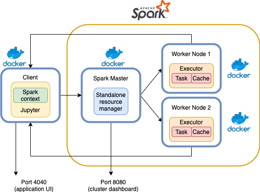

# MAPD2021

Lectures for Management and Analysis of Physics Datasets course Msc in Physic of Data at University of Padua 2020-2021.

## Docker

It is possible to run all the exercises using docker. This is particularly usefull if you are experiencing problems with virtual
or you don't want to go to the trouble of setting up the environment. 

In this way, the only thing you need to install is docker itself (instructions for Mac, Windows and linux
can be found [here](https://docs.docker.com/get-docker/))

You can choose to run it in two ways: using a single container, similarly to what you were doing when setting up a local cluster,
or by using docker compose to simulate the behaviour of a real cluster, where master and workers will be on different nodes.

Clone this repo if has not already been done, i.e. `git clone https://github.com/Mmiglio/MAPD2021.git`

### Single container

Run the following command, from inside MAPD2021 directory, to create a container with spark and jupyter already installed.
The first time you run it may take a while because it needs to download all the necessary components and libraries.
However, the next times you will need this container it will be created instantly since all the components are cached.

```
docker run --rm -it \
        -p 8888:8888 \
        -p 4040:4040 \
        -p 8080:8080 \
        -v $PWD:/opt/workspace \
        miglio/mapd:spark-jupyter
```

Once it has been created,  you will see some logs from the jupyter server. At this point you can connect to jupyter from 
your browser typing `localhost:8888`. Make sure that other jupyter are not using this port. 

Test if everything is working with the notebook `notebooks/docker/Docker.ipynb`


### Docker cluster

We can simulate multiple nodes by using multiple docker containers: A container hosting jupyter server and acting as the client
node of the cluster, a container with the resource manager and one container for each worker. In this case you can think each container
as a *virtual machine*. This setup is simulating what you experience on a real cluster. 



This cluster can be spawned with 

```
docker compose up
```

By defalult only one worker is created. If you want to use N workers you can scale the cluster with

```
docker compose up --scale spark-worker=N
```

Again, after the cluster has been created you can navigate to `localhost:8888` to open the jupyter dashboard. In this case the master
has already been created, you don't need to start it manually. Indeed the cluster dashboard will be already available on
`localhost:8080`. See the example notebook on `notebooks/docker/Docker-Cluster.ipynb`.

If you want to use more resources per each worker, edit the file `docker-compose.yml` and change `SPARK_WORKER_CORES` and `SPARK_WORKER_MEMORY`
to the value you prefer. 

The cluster can be shut down either by pressing `ctrl+C` or by typing
```
docker compose down
```

In case you have stopped it by pressing `ctrl+C` remove the containers and network with `docker compose rm -f`.

## Lecture 1

* Creation of a Spark standalone cluster
* Basic commands (parallelize, map, reduce, ...)
* Spark application WebUI
* Word count, computing pi and distributed gradient descent

## Lecture 2

* Spark dataframe
* Basic dataframe operations
* UDF and PandasUDF

## Lecture 3

* Spark Streaming
* Streaming from TCP Socket
* Dataframes in spark streaming
